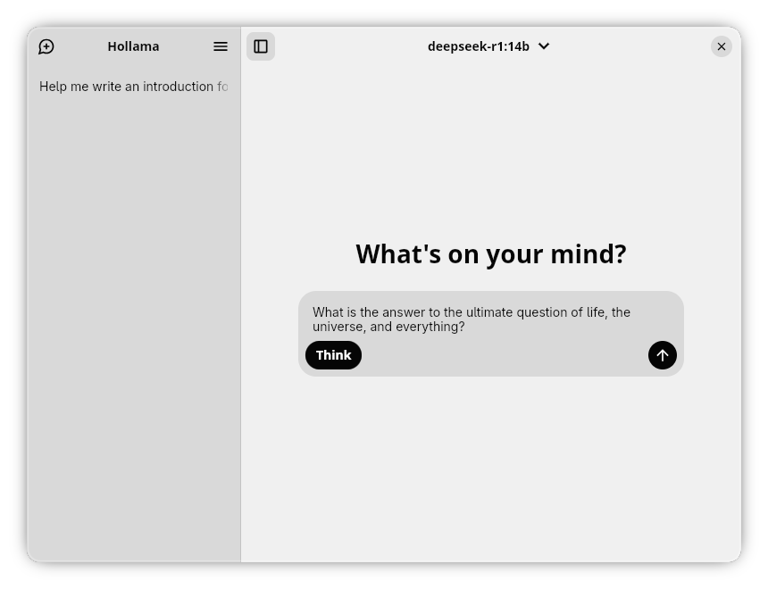
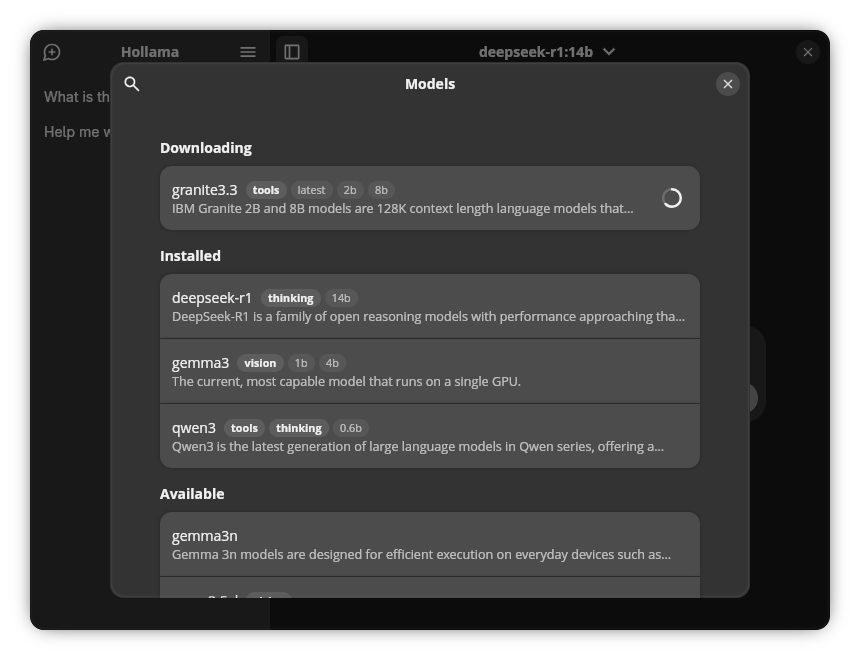

# Hollama

Hollama is a sleek and intuitive desktop client for [Ollama](https://ollama.com), built with Tauri. It provides a beautiful and user-friendly interface for interacting with your favorite Ollama models, right from your desktop.





## ✨ Features

- **Chat with your models:** Have seamless conversations with any of your installed Ollama models.
- **Model Management:** Easily view, pull, and delete models from your Ollama instance.
- **Sleek Interface:** A clean and modern user interface that gets out of your way.
- **Cross-Platform:** Works on Windows\*, macOS\*, and Linux.
- **Lightweight:** Built with Tauri, Hollama is a small and efficient application.

> \* Bundle not included in release.

## 🚀 Getting Started

### Prerequisites

- You need to have [Ollama](https://ollama.com) installed and running on your machine.

### Installation

You can download the latest version of Hollama from the [releases page](https://github.com/rasmusmerzin/hollama/releases).

### Development

To run Hollama in a development environment, you'll need to have Node.js and Rust installed.

1.  **Clone the repository:**

    ```bash
    git clone https://github.com/merzin/hollama.git
    cd hollama
    ```

2.  **Install dependencies:**

    ```bash
    npm install
    ```

3.  **Run the development server:**
    ```bash
    npm run tauri dev
    ```

## 🛠️ Built With

- [Tauri](https://tauri.app) - A framework for building tiny, blazing fast binaries for all major desktop platforms.
- [TypeScript](https://www.typescriptlang.org) - A typed superset of JavaScript that compiles to plain JavaScript.
- [Vite](https://vite.dev) - A fast build tool that provides a quicker and leaner development experience for modern web projects.
- [Rust](https://www.rust-lang.org) - A language empowering everyone to build reliable and efficient software.

## 🤝 Contributing

Contributions are welcome! Please feel free to submit a pull request or open an issue.

## 📝 License

This project is licensed under the MIT License - see the [LICENSE](./LICENSE) file for details.
